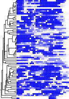

# type-II-A-leader-repeat

This repository has code relevant to the paper "Spacer prioritization in CRISPR-Cas9 immunity is enabled by the leader RNA".  The scrips were used to generate Figure 5A of this paper and to calculate aggregate p-values to support the hypothesis that the leader-repeat interaction studied in the paper is widely used within type II-A systems.

## License

The repository is freely available under version 3 of the GNU Public License (see the file `LICENSE` in the top directory of this repository).

## Installation

The scripts require Python version 3, a recent version of Perl and the bash interpreter.  The only non-standard Python library is the Python bindings for the [ViennaRNA library](https://www.tbi.univie.ac.at/RNA/)  You'll likely have to set the `PYTHONPATH` environment variable to point to the `site-packages` directory in which the Python bindings are installed.  The remaining Python libraries should be in the repository.  For the script to draw the diagrams in Figures 5A, note that the `skbio` module is defined in the package `scikit-bio`.

To generate Figure 5A, the software packages Clustal Omega and Phylip are required, as explained below.

## About the data in this repository

Data under the directory `data/original` came from co-author Omer Alkhnbashi's predictions of the relevant type.  Each line corresponds to one system and consists of three tab-delimited fields.  The first field is an identifier for the system.  The second field is the 180 nucleotides upstream of the predicted first repeat (i.e., the potential leader).  The third field is the sequence of the predicted first repeat.

As described in the paper, this data was split into training and test datasets, which are available in the directory `data/training-test`.  Each file name describes the sub-type and whether the data is training or test data.  For example, the file `II-A--training.tab` is the training data for type II-A systems.  These files are constructed using the script `py/ChaseTrainingValidationTestData.py` based on the data in `data/original`, such that the leader of each system within a (training or test) dataset is no more than 70% identical to another system, and each leader sequence in the training dataset is at most 50% identical to any leader in the test dataset.  The format of each dataset file is the same as the files in `data/original`. There are just fewer lines.

Our initial test dataset for type II-C systems is in the directory `data/training-test/old/old-II-C--test.tab`. Subsequent analysis suggested that some of these systems might not be correctly classified, so we conservatively removed them the test dataset (see file `data/training-test/II-C--test.tab`).  Neither of these type II-C datasets have significant aggregate p-values.

We used a subset of systems to draw Figure 5A.  These subsets are in the directory `data/figure-data`.

## About the scripts

The scripts are almost exclusively written in Python.  The scripts are prefixed with "Chase", which was my code for this project.  For the Python scripts, a description of command line arguments and possible flags can be obtained by running the script with the flag `-h`. In summary, there are the following:

- `ChaseExtractKeyFieldsWithActualValue.py` : This script is not necessary to reproduce the paper's results.  It was for visualizing specific statistics, and for drawing MFE structures for visualization.  Creating the drawing would require the [R2R software](https://sourceforge.net/projects/weinberg-r2r/).
- `ChaseFigureFromFolding.py` : Makes blue-dot figures, like in Figure 5A of the paper.
- `ChaseFolding.py` : Main script to calculate folding statistics for a set of systems.  Aggregate p-values are calculated in `ChaseSummarize.py`.
- `ChaseGC.py` : This script is not necessary to reproduce the paper's results.  It was for looking at the G+C content of leaders and repeats.
- `ChaseLibrary.py` : This file provides functions used by other scripts.  It cannot be run directly.
- `ChaseSummarize.py` : Summarize the data created by `ChaseFolding.py` to compute aggregate p-values and draw histograms for all statistics.  (The histograms were not reported in the paper.)  The aggregate p-values listed at the top of Figure 5A in the paper come from this script.
- `ChaseTrainingValidationTestData.py` : Cluster a set of systems (using one of the files in `data/original`) to reduce correlations and create training, validation and test data.  Due to the small number of type II-A and type II-C systems, we just created training and test datasets.  The files in the `data/training-test` directory were created with this script.  This script is not actually necessary to validate our results, since it can be verified that the sequences within each (training or test) dataset have at most 70% identity, and the cross-training-test dataset sequences have at most 50% identity.
- `ChaseVarious.sh` : This script is not necessary to reproduce the paper's results.  Run scripts with different flags, e.g. to see if reclassifying some 3' leader nucleotides as being the repeat makes a difference.
- `ChaseVariousVarious.pl` : This script is not necessary to reproduce the paper's results.  More control over tests.
- `abbrev-distmat.pl` : helper script needed for the blue-dot diagrams (like in Figure 5A). It converts the distance matrix output by Clustal Omega to a format that the Phylip software can process.
- `altschulEriksonDinuclShuffle.py` : code for randomly shuffling the leader sequences while preserving dinucleotide frequencies. The code is lightly adapted from code that Peter Clote wrote (see supplementary methods of our paper for details).

## Example commands to compute aggregate p-values

The output of the following commands is already in the directory `demo-output`.  You can generate this data yourself as follows.

From the root of this repository, run the following commands.  First, compute folding statistics.  In the following command line, the `--cpu 12` flag means that the script will run 12 processes to parallelize the calculations.  I observed diminishing returns with higher number of processes on the server I used.  This command took 27 minutes with 12 processes on this server.  The `--fix-bug1` fixes a bug that caused slightly distorted results.  This flag should always be used, as the results reported in the paper used it.  The script will refuse to run without it.

> `python3 src/ChaseFolding.py -o demo-output/II-A--test.folding --num-sample 1000 --num-boltzmann 1000 --print-actual-value --no-within-repeat --cpu 12 --fix-bug1 data/training-test/II-A--test.tab`

Then you can process the folding statistics to compute aggregate p-values and see histogram plots of the individual p-values:

> `python3 src/ChaseSummarize.py --out-dir demo-output/II-A--test--summarize demo-output/II-A--test.folding`

(The command takes several seconds to run.)

The most important output file is `demo-output/II-A--test--summarize/summary.pdf`.  For each statistic, there's a page with a histogram of the distribution of p-values for all systems analyzed, and an aggregate p-value.  This aggregate p-value is at the top of the page.  For example, on the first page the aggregate p-value is `0.00017996591285661674` (in the repository file `demo-output/II-A--test--summarize/summary.pdf`).  If you run the script yourself, you might get a somewhat different answer because there is a significant amount of randomness in the calculations.  The first statistic in the file is the average probability of pairing for the repeat nucleotides ("`avgPairProbs`").  The helix-based statistics have the form helix-$x$-$y$, where $y$ is the minimum number of base pairs in a helix and $x$ is the maximum number of bulged nucleotides or mismatched base pairs.  We used `helix-0-8` in the paper (based on the results with the training data), which corresponds to the probability of a helix with at least 8 uninterrupted base pairs ($x=0$) that cross the leader/repeat boundary, at thermodynamic equilibrium.  On page 16 of the PDF file, we see that the aggregate p-value is `2.3896567730415203e-06`.  (Again, some variability due to randomness is expected.)

## Example commands to draw a blue-dot figure (like in Figure 5A)

This process requires extra software that is not required by the other scripts, specifically, the `clustalo` command from the Clustal Omega package and the `neighbor` command from the Phylip package.

The dots in this diagram show the probability that each nucleotide in the repeat is involved in a base pair with a nucleotide in the leader at thermodynamic equilibrium.  The tree at left shows the relationships between the sequences, and was computed using the UPGMA algorithm.  The UPGMA algorithm ensures that all leaves are at the same height, which is convenient for the figure.  Note that there was no intention to make the tree phylogenetically meaningful; it is just qualitatively depicting the similarities between the sequences.

Here we draw the blue-dot figure for type II-A.  For this figure, we combined training and test systems, so that all systems were output at a maximum percent identity of 70%.  It would also be possible to plot all systems.  For types II-C, I-E and I-F, we used the `ChaseTrainingValidationTestData.py` script to remove similar systems until there were roughly 68 systems, but this is not necessary.  The files with the reduced number of systems are in the directory `data/figure-data` of this repository.

To combine the systems:

> `cat data/training-test/II-A--training.tab data/training-test/II-A--test.tab > demo-output/II-A-systems-for-figure.tab`

(This is equivalent to the file `data/figure-data/data/figure-data`.)

Then we convert the repeat sequences into a FASTA-format file, for further processing:

> `cat demo-output/II-A-systems-for-figure.tab  | cut -f 1,3 | sed "s/^/>/" | tr "\t" "\n" > demo-output/II-A-systems-for-figure.fasta`

Next we compute a distance matrix using the `clustalo` command:

> `clustalo --in demo-output/II-A-systems-for-figure.fasta -t RNA --guidetree-out=demo-output/II-A-systems-for-figure.guidetree --out=demo-output/II-A-systems-for-figure.sto --outfmt=st --output-order=tree-order --distmat-out=demo-output/II-A-systems-for-figure.distmat --full`

(It'll likely say: `WARNING: Overriding automatically determined seq-type DNA to RNA as requested`. This warning is benign.)

In the next steps, we'll infer a UPGMA tree using the Phylip software.  But first, we need to convert the distance matrix format and shorten the sequence names so that the Phylip software can read it.  There's a Perl script for that:

> `perl src/abbrev-distmat.pl demo-output/II-A-systems-for-figure.distmat demo-output/II-A-systems-for-figure.phylip-distmat demo-output/II-A-systems-for-figure.phylip-tree demo-output/II-A-systems-for-figure.my-names-phylip-tree`

(Some of the files mentioned in the above command line are not actually made yet.  We'll re-run this command later, when all its input is ready, and all files will be created.)

Next, we run the UPGMA algorithm using the `neighbor` command from the Phylip software:

> `neighbor < demo-output/II-A-systems-for-figure.neighbor-stdin`

(The `demo-output/II-A-systems-for-figure.neighbor-stdin` file tells the `neighbor` command to load the file `demo-output/II-A-systems-for-figure.phylip-distmat` and to use the UPGMA algorithm instead of Neighbor-Joining.  NOTE: the input file name is hardcoded within `demo-output/II-A-systems-for-figure.neighbor-stdin`. If you want to process a different file, you must either change this file, or interact with the `neighbor` program directly.)

And save the output we need with a meaningful name:

> `rm outfile`
>
> `mv outtree demo-output/II-A-systems-for-figure.phylip-tree`

And convert the names in Phylip's tree back to the original ones (using the same command as above, but this time we have all the necessary data).

> `perl src/abbrev-distmat.pl demo-output/II-A-systems-for-figure.distmat demo-output/II-A-systems-for-figure.phylip-distmat demo-output/II-A-systems-for-figure.phylip-tree demo-output/II-A-systems-for-figure.my-names-phylip-tree`

And finally we can make the figure (this command takes a few seconds to run):

> `python3 src/ChaseFigureFromFolding.py demo-output/II-A-systems-for-figure.tab -o demo-output/II-A-systems-for-figure.figure --use-prob --no-within-repeat --phylip-tree demo-output/II-A-systems-for-figure.my-names-phylip-tree`

The figure is in the file `demo-output/II-A-systems-for-figure.figure.draw.pdf`, and looks like this:

This figure was processed with a drawing program to augment it for the final figure.

You can also generate the figure using the following command, if all required software is installed:

> `src/make-figure.sh data/figure-data/II-A-systems-for-figure.tab II-A-figure`

(The final output is the file `II-A-figure.draw.pdf`)

You can draw all 4 figures with this command:

> `src/make-4-figures.sh`

